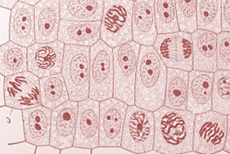
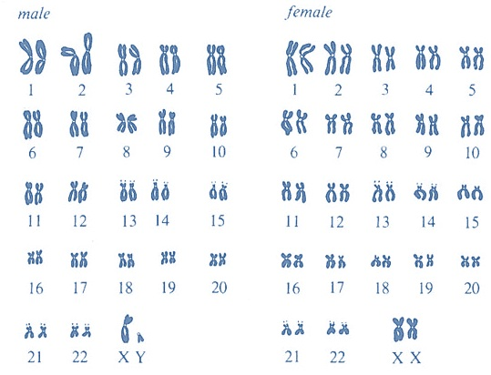
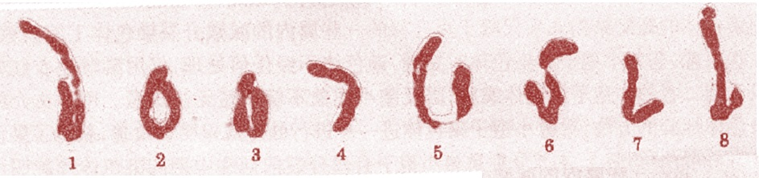

### Theory
 
A process by which a parent cell divides into two or more daughter cells is called cell division. Cell division is a small part of the cell cycle. In normal eukaryotic cells, the type of cell division is known as mitosis.

Another type of cell division is  present in reproductive cells of eukaryotes and is known as meiosis. Cell cycle is mainly classified into two segments: M-phase and Interphase. Interphase is the longer period of cell division. During this phase the cell prepares for its next stage.

This is a period of diverse activities and these activities are a prerequisite for the next mitotic phase. Interphase is mainly divided into three phases: G1 phase, S phase and G2 phase. S phase is the period of replication. G1 and G2 are the two gap phases during which the cell grows, producing proteins and preparing the cells. These phases also have certain check points and the whole cell cycle is strictly regulated.

 

M phase of the cell cycle stands for Mitosis or nuclear division. In eukaryotes, DNA replication is followed by a process called mitosis which separates the chromosomes in its cell nucleus into two identical sets, in two individual nuclei.. Mitosis is followed by cytokinesis. 

The process of Mitosis is divided into four stages: 
. Prophase 

. Metaphase 

. Anaphase 

. Telophase.

 &nbsp;
 
#### Prophase: 
During this stage, the chromosomes super coil, condense and become visible for first time during the cell cycle. The spindle fibers start forming. The nuclear membrane starts disintegrating.

 

#### Metaphase: 
During this stage, the spindle fibers reach and attach to centromere of each sister chromatids. The chromosomes align along the center plane of the cell. The nuclear membrane disintegrates completely.

 

#### Anaphase: 
During this stage, the centromeres start splitting and the sister chromatids begin to migrating towards the opposite poles of the cell.

 

#### Telophase: 
During this stage, the chromosomes are clustered on the either end of the cell. The nuclear membrane starts reforming. The cell plate (new cell wall) starts to form between the two daughter nuclei. This will be followed by cytokinesis.

 

 &nbsp;
 
### Mitosis in Onion Root Tip

The genetic information of all organisms resides in the individual DNA molecules or chromosomes. An onion cell possesses eight chromosomes lwhereas human cells possess forty six chromosomes.

In 1842, C. Nägeli first saw chromosomes and in 1888 W. Waldeyer named them. Walther Flemming studied and named the process of cell division as mitosis.  Cell division occurs rapidly in growing root tips of sprouting seeds or bulbs.

The most commonly used root tips in labs to study mitosis are onion, wheat, lentil, barley and alfalfa. An onion root tip is a rapidly growing part of the onion and thus many cells will be in different stages of mitosis. The onion root tips can be prepared and squashed in a way that allows them to be flattened on a microscopic slide, so that the chromosomes of individual cells can be observed easily. The super coiled chromosomes during different stages of mitosis present in the onion root tip cells can be visualized by treating with DNA specific stains, like Feulgen stain and Acetocarmine stain.

&nbsp;

Mitosis in Onion Root Tip

 

&nbsp;

### Mitotic Index
 

The percentage of cells undergoing mitosis or it is defined as the ratio of no. of cells in the dividing phase to the total number of cells observed. This will help to identify the region of most mitotic activities. Mitotic index helps us to quantify the cell division. Mitotic index decreases with increasing distance from root tip. That means gradual decrease in cell division as it moves from the zone of cell division to the zone of cell elongation. The meristematic region in the root tip is the actively growing region and thus the mitotic index is high.

 &nbsp;
                                                                        

##### Mitotic index = n/N × 100

 
 &nbsp;
 
Mitotic index is used to quantify the differences in cell division when environmental parameters are changed. Studies have already proved that, the plants grown in space in microgravity have a greater mitotic index than plants grown on the ground. The gravity sensing signals in the root cap are unable to send proper orientation signals which inhibit growth in the cells that are distant from the root tip and root cap junction when kept in zero gravity. This leads to mitosis in greater number of cells and plants also produce secondary roots at a high rate.

 

 &nbsp;
 
#### Karyotype and Karyotype Analysis
 

 A karyotype is a technique that allows researchers to visualize the chromosomes under the microscope with the help of proper extraction and staining techniques. The karyotype is an organized profile of an organism’s chromosomes arranged in pairs. In a karyotype, the chromosomes are arranged and numbered, based on size from largest to smallest, centromere position and banding pattern (due to staining) of chromosomes. This technique helps scientists  identify any chromosomal abnormalities and alterations that may result in genetic problems and disorders.

 

Karyotype of any organisms is obtained easily by serious of small steps. For that, first simulate the cell division of the cells. After simulating the cell division, the cells are arrested by cholchine treatment at metaphase stage of the cell division by preventing the formation of spindle fibers. The chromosomes shorten and become more tightly coiled making their shapes more distinct and become more visible under the light microscope during the metaphase stage of the cell division.

This cholchine treated cell mixture is centrifuged and the resulting pellet is immersed in a hypotonic solution that causes the cell to swell and so allows more space for chromosomes to spread. Then a fixing agent is applied on the cell to freeze the chromosomes from moving and a stain is used to visualize the chromosomes and their banding pattern.  A photograph of the chromosomes is taken, cut, paired and rearranged to give a karyotype.

 
&nbsp;

Karyotype of Human Male and Female

 &nbsp;
 
The karyotype analysis displays the banding pattern of the chromosomes. This banding pattern allows scientists to recognize specific parts of the chromosomes and to identify the deletions and translocations that occurred in the chromosomes. This helps to identify different genetic disorders in humans and other organisms. The number, shapes and sizes of the condensed chromosomes vary for each species and so the closely related species can be distinguished from each other.

 

In order to perform onion root tip karyotype analysis, the procedure is a little different and less complex from the above one since this is a plant source. The onion roots were grown in water and its tips were subsequently cut off and fixed in 3:1 ethanol: glacial acectic acid.

The sample is then stained with DNA specific stains like Acetocarmine or Feulgen stain in acectic acid and was subjected to squash method. Then the thin layer of cell squash on the slide was viewed under the light microscope. Then the cell was photographed and documented. By using actively dividing cells in the onion root tip, this experiment aims to obtain a karyotype from the sample and to determine the purpose of each step used in the procedure.

&nbsp;

Karyotype of Onion Root Tip Cell

 

 